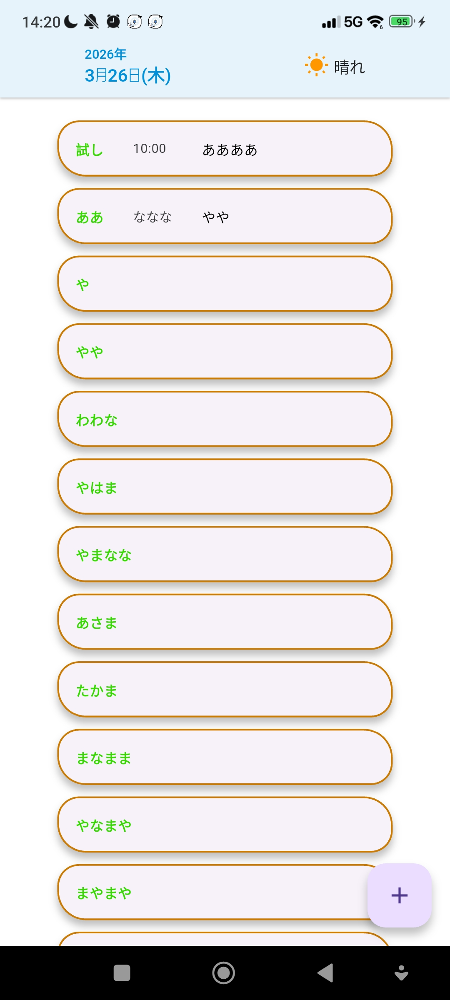
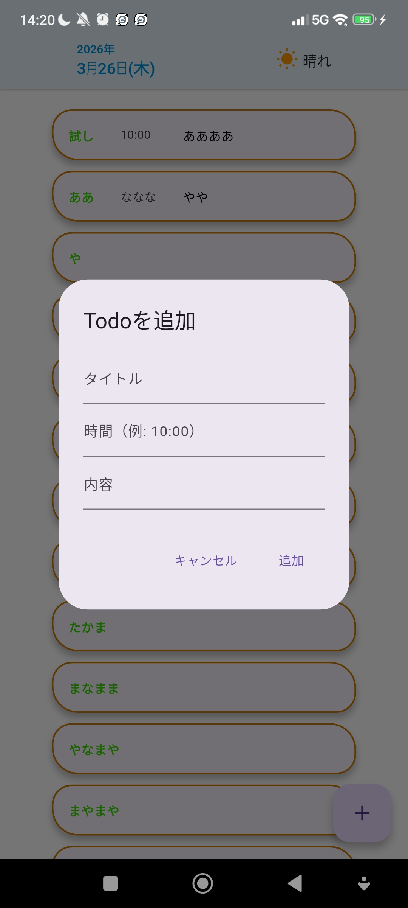

# Flutter Todo App

Flutter入門後の最初の自作アプリ。学習記録として制作。


---

## 機能

- Todoの一覧表示
- Todoの追加（タイトル・時間・内容）
- Todoの削除（左スワイプ）
- 完了チェック（タップで取り消し線）
- データの永続化（アプリを閉じても保存）
- 今日の日付を動的に表示

---

## 使用技術

- Flutter / Dart
- StatefulWidget + setState による状態管理
- shared_preferences によるローカル保存

---

## 学んだこと

### クラスとインスタンス
データの設計図をクラスで定義し、実際のデータをインスタンスとして生成する考え方を学んだ。

```dart
class Todo {
  final String title;
  final String time;
  final String content;

  const Todo({required this.title, required this.time, required this.content});
}
```

### データとUIの分離
TodoデータをListで管理し、`.map()` でUIに変換するパターンを学んだ。直接ウィジェットにデータを埋め込む書き方から脱却できた。

```dart
children: todos.map((todo) {
  return _buildTodoItem(todo.title, todo.time, todo.content);
}).toList(),
```

### StatefulWidget への変換
画面の状態が変わる場合は `StatefulWidget` と `State` クラスの2つに分ける必要があることを学んだ。

### setState
データを変更したあとに `setState()` を呼ぶことで画面が再描画される仕組みを理解した。

```dart
setState(() {
  todos = [...todos, newTodo];
});
```

### TextEditingController
テキストフィールドの入力値を取得・クリアするための仕組みを学んだ。

### Dismissible（スワイプ削除）
`Dismissible` ウィジェットでカードを左スワイプしたときに削除する機能を実装した。`where()` を使って削除対象以外のTodoだけ残す方法を学んだ。

```dart
Dismissible(
  key: Key(todo.title),
  direction: DismissDirection.endToStart,
  onDismissed: (direction) {
    setState(() {
      todos = todos.where((t) => t != todo).toList();
    });
  },
  child: ...,
)
```

### GestureDetector と三項演算子（完了チェック）
`GestureDetector` でタップを検知し、`isDone` フラグを反転させることで完了状態を切り替えた。三項演算子でUIを動的に変える方法も学んだ。

```dart
// isDoneがtrueなら取り消し線、falseなら通常表示
decoration: isDone ? TextDecoration.lineThrough : null,
```

### shared_preferences（データの永続化）
`shared_preferences` パッケージを使ってデータをローカルに保存する方法を学んだ。`toJson()` / `fromJson()` でTodoオブジェクトをJSON文字列に変換して保存・復元する仕組みを実装した。また `initState` で起動時に読み込む方法も学んだ。

```dart
// 保存
Future<void> _saveTodos() async {
  final prefs = await SharedPreferences.getInstance();
  final String jsonString = jsonEncode(todos.map((t) => t.toJson()).toList());
  await prefs.setString('todos', jsonString);
}

// 読み込み
Future<void> _loadTodos() async {
  final prefs = await SharedPreferences.getInstance();
  final String? jsonString = prefs.getString('todos');
  if (jsonString != null) {
    final List<dynamic> jsonList = jsonDecode(jsonString);
    setState(() {
      todos = jsonList.map((j) => Todo.fromJson(j)).toList();
    });
  }
}
```

### DateTime（日付の動的取得）
`DateTime.now()` で端末の現在日時を取得し、文字列補間で表示する方法を学んだ。

```dart
final now = DateTime.now();
const weekdays = ['月', '火', '水', '木', '金', '土', '日'];
final weekday = weekdays[now.weekday - 1];

Text('${now.month}月${now.day}日($weekday)');
```

---

## 今後追加したい機能

- [x] Todoの削除
- [x] 完了チェック機能
- [x] データの永続化（端末を閉じても消えないように）
- [x] 日付の動的取得
- [ ] 天気の動的取得
- [ ] 通知機能